# 🔄 Flujos del Sistema - Gym Management

## 📋 Índice

1. [Flujo de Autenticación](#1-flujo-de-autenticación)
2. [Flujo de Registro de Usuario](#2-flujo-de-registro-de-usuario)
3. [Flujo de Contratación de Plan](#3-flujo-de-contratación-de-plan)
4. [Flujo de Pago](#4-flujo-de-pago)
5. [Flujo de Asistencia](#5-flujo-de-asistencia)
6. [Flujo de Gestión de Membresías](#6-flujo-de-gestión-de-membresías)
7. [Flujo de Reportes](#7-flujo-de-reportes)
8. [Flujos por Rol](#8-flujos-por-rol)

---

## 1. Flujo de Autenticación

### 🔐 Login (Cualquier Rol)

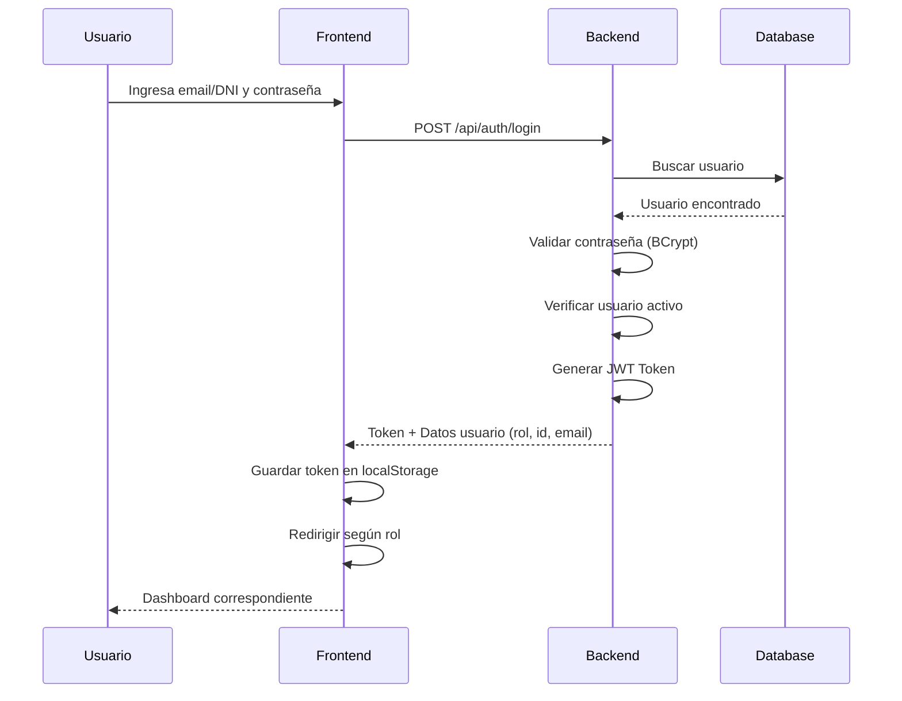

**Endpoints:**
- `POST /api/auth/login`

**Request:**
```json
{
  "emailOrDni": "admin@gym.com",
  "password": "password123"
}
```

**Response:**
```json
{
  "token": "eyJhbGciOiJIUzI1NiIsInR5cCI6IkpXVCJ9...",
  "usuario": {
    "id": 1,
    "nombre": "Admin",
    "apellido": "User",
    "email": "admin@gym.com",
    "rol": "ADMINISTRADOR"
  }
}
```

**Redirección por rol:**
- CLIENTE → `/cliente/dashboard`
- RECEPCIONISTA → `/recepcionista/dashboard`
- ADMINISTRADOR → `/admin/dashboard`

---

## 2. Flujo de Registro de Usuario

### 👤 Registro Público (Cliente)

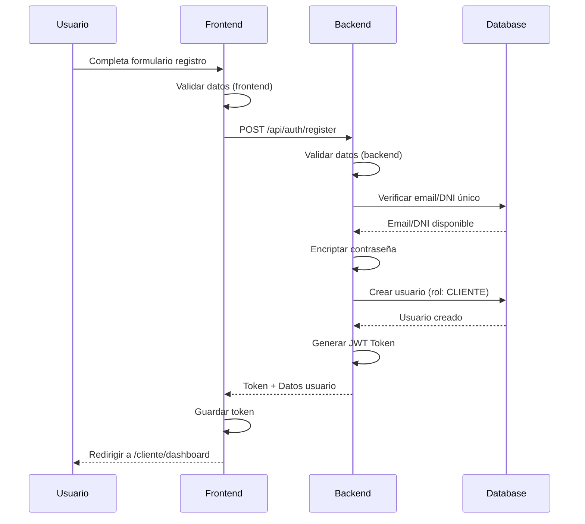

**Endpoint:**
- `POST /api/auth/register`

**Request:**
```json
{
  "nombre": "Juan",
  "apellido": "Pérez",
  "email": "juan@email.com",
  "dni": "12345678",
  "password": "password123",
  "telefono": "999888777",
  "genero": "MASCULINO",
  "fechaNacimiento": "1990-05-15"
}
```

### 👨‍💼 Creación de Usuario por Admin

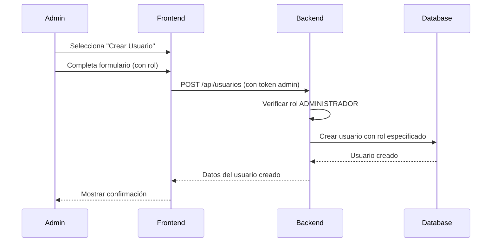

**Endpoint:**
- `POST /api/usuarios` (Solo ADMIN)

---

## 3. Flujo de Contratación de Plan

### 📋 Cliente Contrata un Plan

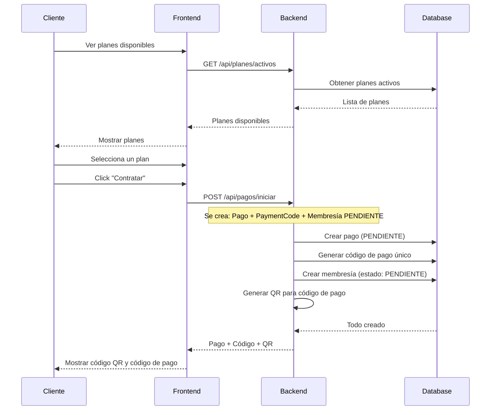

**Endpoints:**
1. `GET /api/planes/activos` - Ver planes
2. `POST /api/pagos/iniciar` - Iniciar contratación

**Request Iniciar Pago:**
```json
{
  "usuarioId": 5,
  "planId": 3,
  "metodoPago": "EFECTIVO"
}
```

**Response:**
```json
{
  "pagoId": 123,
  "codigoPago": "GYM-2024-XYZ789",
  "qrDataUri": "data:image/png;base64,iVBORw0...",
  "monto": 150.00,
  "estado": "PENDIENTE",
  "fechaExpiracion": "2024-11-25T23:59:59"
}
```

---

## 4. Flujo de Pago

### 💳 Confirmación de Pago (Recepcionista)

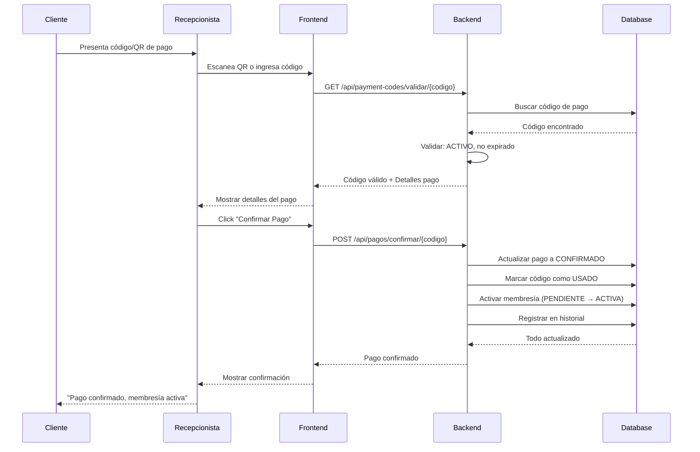

**Endpoints:**
1. `GET /api/payment-codes/validar/{codigo}` - Validar código
2. `POST /api/pagos/confirmar/{codigo}` - Confirmar pago

**Estados del Pago:**
- `PENDIENTE` → Cliente generó el pago
- `CONFIRMADO` → Recepcionista confirmó
- `RECHAZADO` → Admin rechazó (devolución)
- `CANCELADO` → Cliente canceló antes de pagar

---

## 5. Flujo de Asistencia

### 🚪 Registro de Entrada al Gimnasio

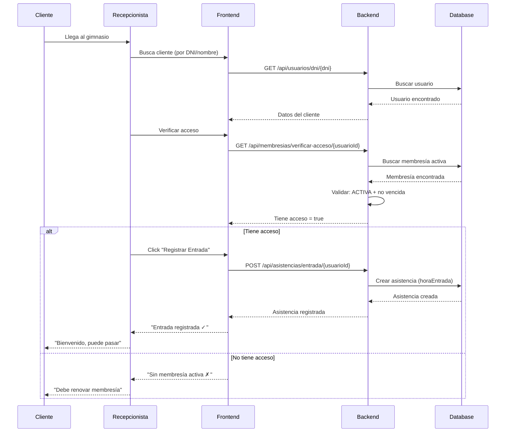

### 🚪 Registro de Salida

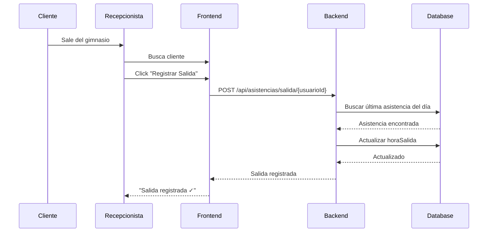

**Endpoints:**
1. `GET /api/membresias/verificar-acceso/{usuarioId}` - Verificar acceso
2. `POST /api/asistencias/entrada/{usuarioId}` - Registrar entrada
3. `POST /api/asistencias/salida/{usuarioId}` - Registrar salida

---

## 6. Flujo de Gestión de Membresías

### 📋 Estados de Membresía

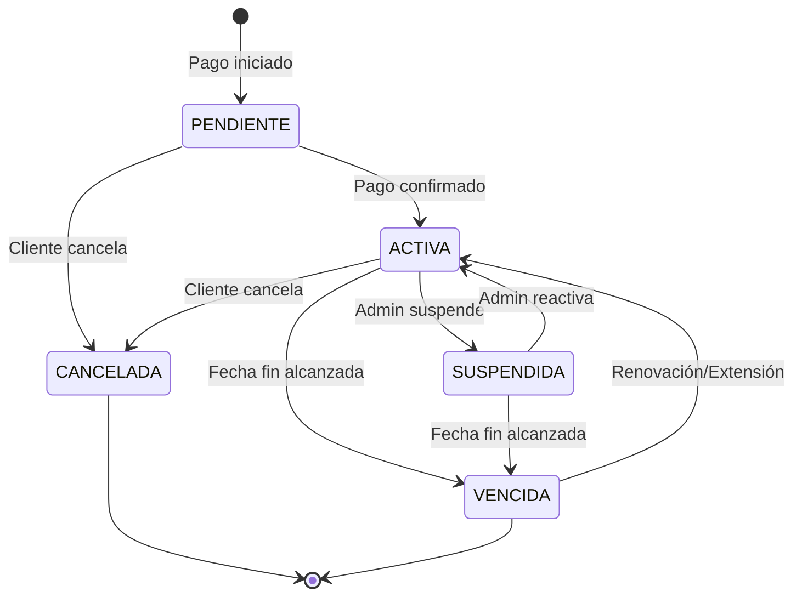

### 🔄 Extensión de Membresía

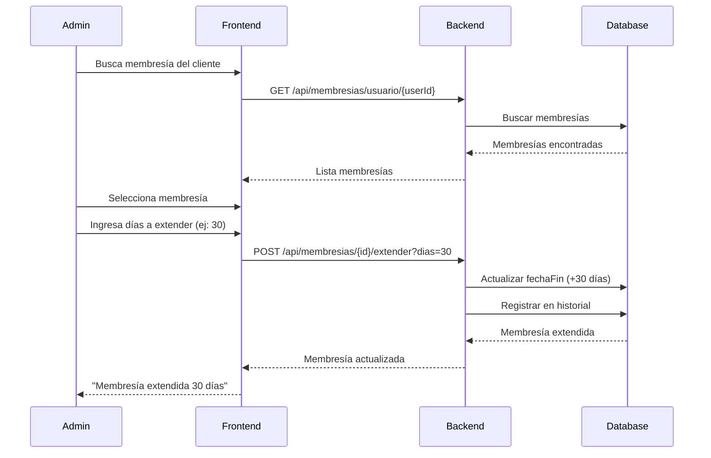

**Endpoints:**
- `POST /api/membresias/{id}/extender?dias={dias}` - Extender
- `POST /api/membresias/{id}/suspender` - Suspender
- `POST /api/membresias/{id}/reactivar` - Reactivar
- `POST /api/membresias/{id}/cancelar` - Cancelar

---

## 7. Flujo de Reportes

### 📊 Generación de Reportes (Admin/Recepcionista)

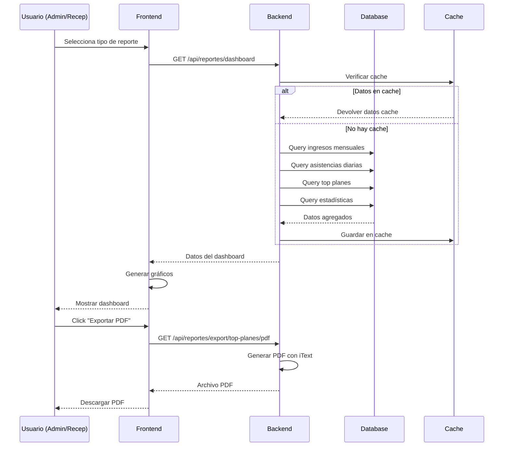

**Endpoints Principales:**
- `GET /api/reportes/dashboard` - Dashboard consolidado
- `GET /api/reportes/ingresos-mensuales` - Ingresos
- `GET /api/reportes/asistencias-diarias` - Asistencias
- `GET /api/reportes/top-planes` - Planes populares
- `GET /api/reportes/export/{tipo}/pdf` - Exportar PDF
- `GET /api/reportes/export/{tipo}/excel` - Exportar Excel

---

## 8. Flujos por Rol

### 👤 Flujo Completo: CLIENTE

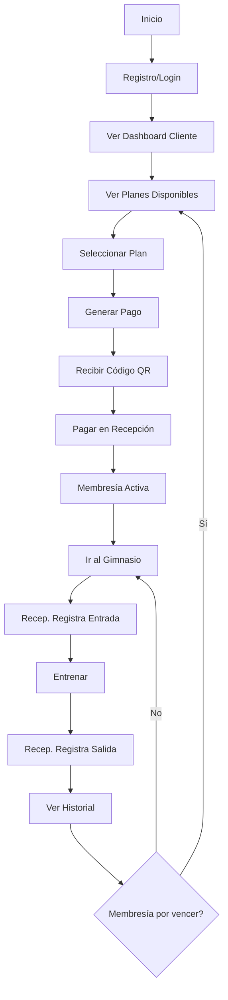

**Acciones del Cliente:**
1. ✅ Registrarse
2. ✅ Login
3. ✅ Ver planes
4. ✅ Contratar plan
5. ✅ Ver código de pago/QR
6. ✅ Ver su membresía actual
7. ✅ Ver su historial de pagos
8. ✅ Ver su historial de asistencias
9. ✅ Actualizar su perfil

---

### 🧑‍💼 Flujo Completo: RECEPCIONISTA

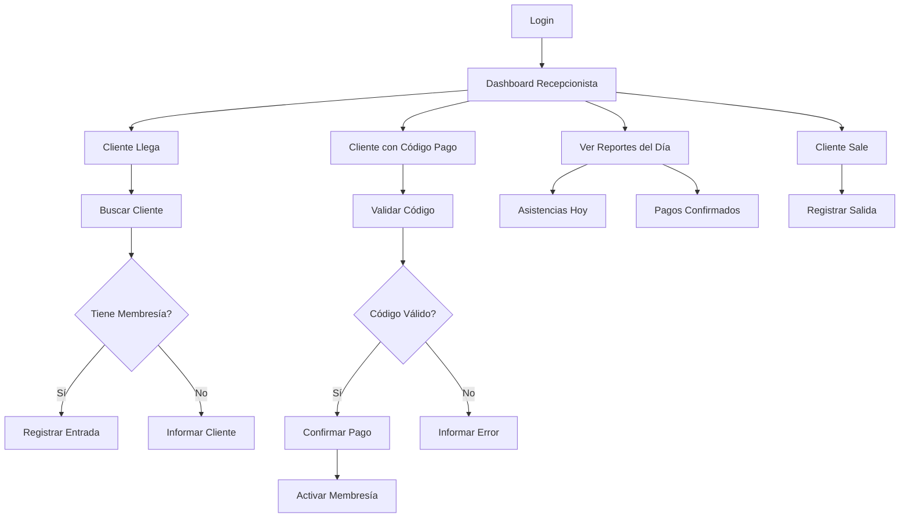

**Acciones del Recepcionista:**
1. ✅ Verificar membresías
2. ✅ Registrar entradas/salidas
3. ✅ Validar códigos de pago
4. ✅ Confirmar pagos
5. ✅ Ver asistencias del día
6. ✅ Ver reportes
7. ✅ Exportar reportes
8. ✅ Generar códigos QR

---

### 👨‍💼 Flujo Completo: ADMINISTRADOR

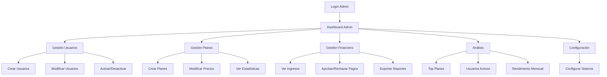

**Acciones del Administrador:**
1. ✅ Todo lo del Recepcionista +
2. ✅ Crear/modificar/eliminar usuarios
3. ✅ Crear/modificar/eliminar planes
4. ✅ Gestionar membresías completas
5. ✅ Aprobar/rechazar pagos
6. ✅ Ver todos los reportes
7. ✅ Configurar sistema
8. ✅ Exportar todo a PDF/Excel

---

## 🔄 Flujo de Estados Completo

### Estado del Pago
```
PENDIENTE → [Recep confirma] → CONFIRMADO
          → [Admin rechaza] → RECHAZADO
          → [Cliente cancela] → CANCELADO
```

### Estado de Membresía
```
PENDIENTE → [Pago confirmado] → ACTIVA → [Fecha fin] → VENCIDA
                                      → [Admin suspende] → SUSPENDIDA
                                      → [Cliente cancela] → CANCELADA
```

### Estado de Payment Code
```
ACTIVO → [Pago confirmado] → USADO
       → [Fecha límite] → EXPIRADO
       → [Cliente cancela] → CANCELADO
```

---

## 📝 Casos de Uso Especiales

### Caso 1: Cliente sin Membresía Intenta Entrar
```
1. Cliente llega al gimnasio
2. Recepcionista busca cliente
3. Verifica membresía: GET /api/membresias/verificar-acceso/{userId}
4. Response: { "tieneAcceso": false }
5. Recepcionista informa: "No tiene membresía activa"
6. Ofrece ver planes disponibles
```

### Caso 2: Código de Pago Expirado
```
1. Cliente trae código después de la fecha límite
2. Recepcionista valida: GET /api/payment-codes/validar/{codigo}
3. Backend responde: Error "Código expirado"
4. Admin puede: 
   - Generar nuevo código
   - Cancelar y crear nuevo pago
```

### Caso 3: Renovación de Membresía Vencida
```
1. Cliente con membresía VENCIDA quiere renovar
2. Cliente/Admin inicia nuevo pago
3. Se crea nueva membresía PENDIENTE
4. Al confirmar pago → ACTIVA
5. Membresía anterior queda VENCIDA (histórico)
```

---

## 🎯 Resumen de Endpoints por Flujo

| Flujo | Endpoints Principales |
|-------|----------------------|
| **Autenticación** | `POST /api/auth/login`, `POST /api/auth/register` |
| **Contratación** | `GET /api/planes/activos`, `POST /api/pagos/iniciar` |
| **Pago** | `GET /api/payment-codes/validar/{codigo}`, `POST /api/pagos/confirmar/{codigo}` |
| **Asistencia** | `POST /api/asistencias/entrada/{id}`, `POST /api/asistencias/salida/{id}` |
| **Membresías** | `GET /api/membresias/usuario/{id}`, `POST /api/membresias/{id}/extender` |
| **Reportes** | `GET /api/reportes/dashboard`, `GET /api/reportes/export/**` |

---

**🎯 Con esta documentación, tienes todos los flujos necesarios para implementar el frontend!**
