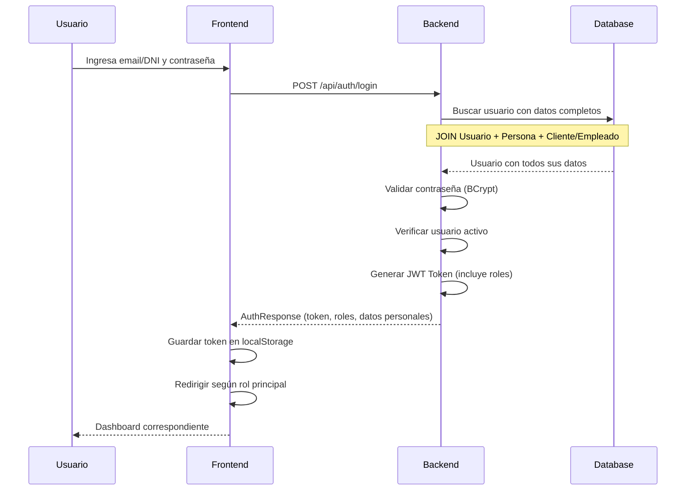
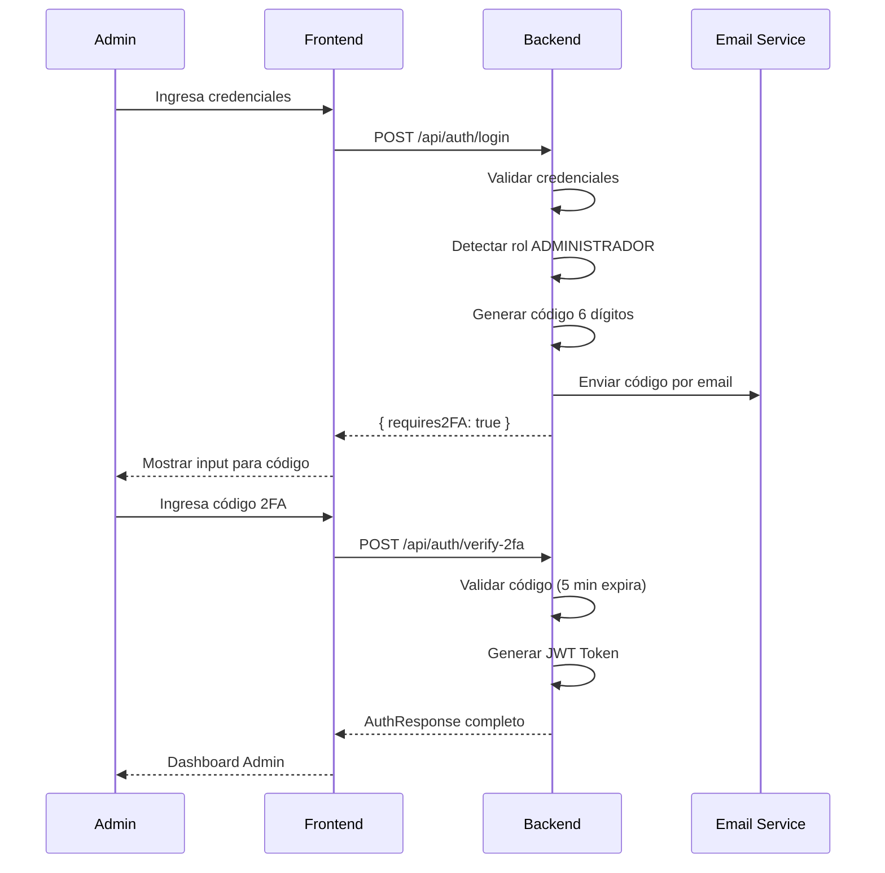
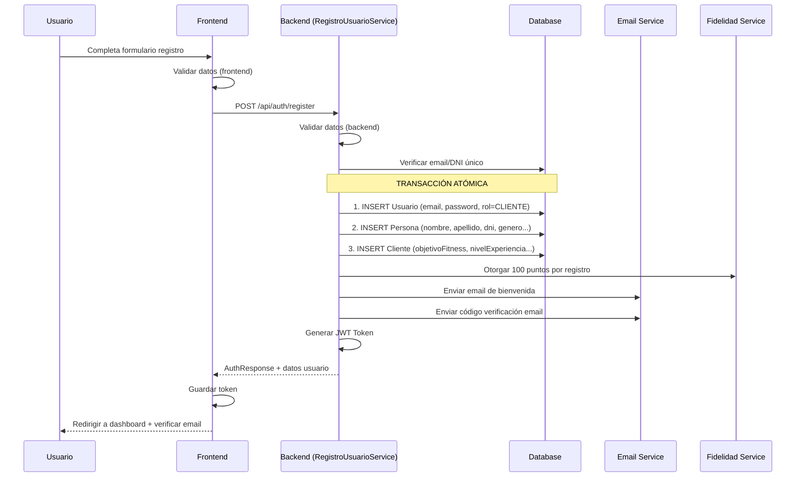
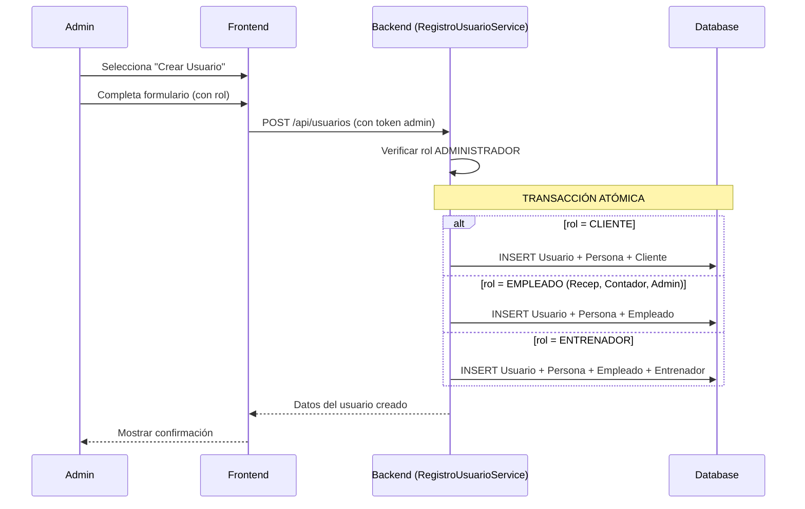
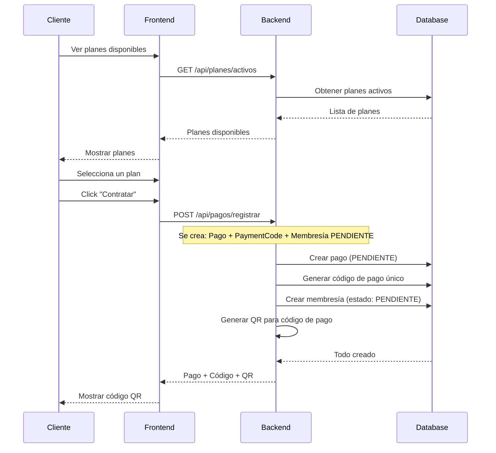
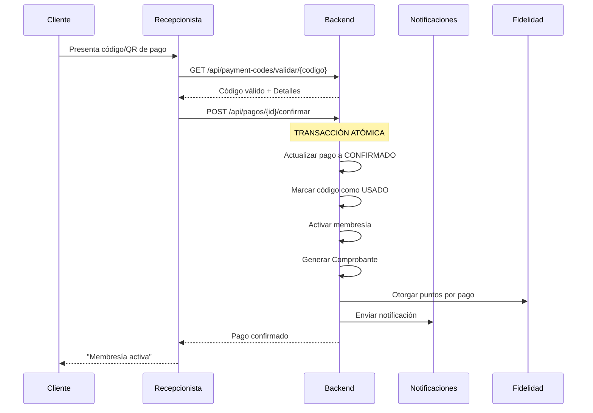
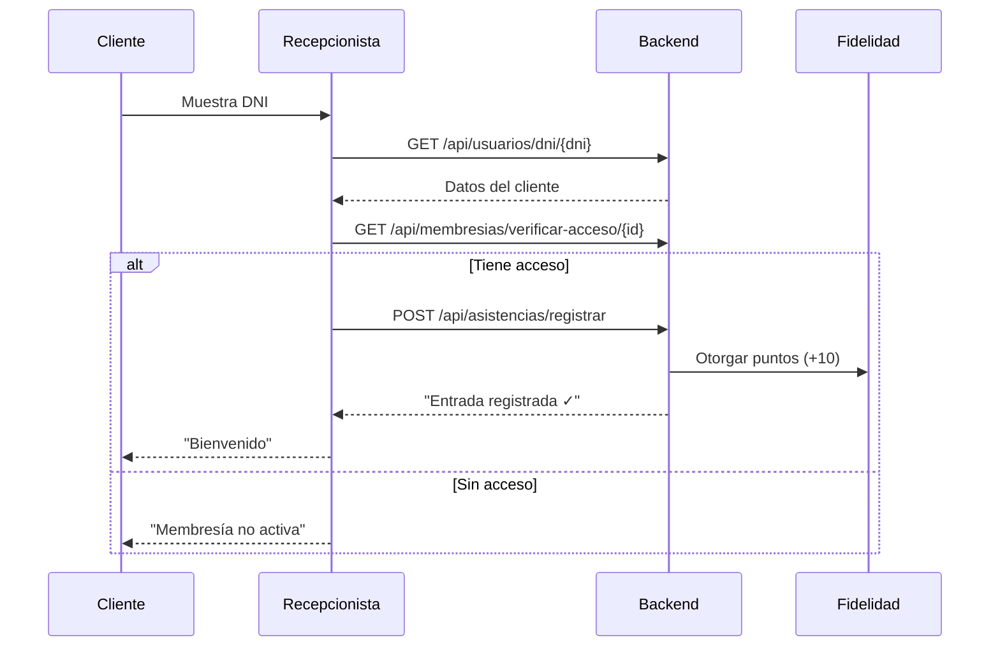

# 🔄 Flujos del Sistema - Gym Management

## 📋 Índice

1. [Modelo de Datos Normalizado](#1-modelo-de-datos-normalizado)
2. [Flujo de Autenticación](#2-flujo-de-autenticación)
3. [Flujo de Registro de Usuario](#3-flujo-de-registro-de-usuario)
4. [Flujo de Contratación de Plan](#4-flujo-de-contratación-de-plan)
5. [Flujo de Pago](#5-flujo-de-pago)
6. [Flujo de Asistencia](#6-flujo-de-asistencia)
7. [Flujo de Gestión de Membresías](#7-flujo-de-gestión-de-membresías)
8. [Flujo de Fidelidad](#8-flujo-de-fidelidad)
9. [Flujo de Clases y Reservas](#9-flujo-de-clases-y-reservas)
10. [Flujo de Rutinas](#10-flujo-de-rutinas)
11. [Flujo de Reportes](#11-flujo-de-reportes)
12. [Flujos por Rol](#12-flujos-por-rol)

---

## 1. Modelo de Datos Normalizado

### 🗄️ Estructura de Usuario (2NF/3NF)

El sistema utiliza una estructura normalizada que separa:
- **Datos de autenticación** (Usuario)
- **Datos personales** (Persona)
- **Datos específicos por tipo** (Cliente/Empleado/Entrenador)

```
┌─────────────────────────────────────────────────────────────────────────────────┐
│                        MODELO DE USUARIO NORMALIZADO                            │
├─────────────────────────────────────────────────────────────────────────────────┤
│                                                                                  │
│   ┌─────────────────┐        ┌───────────────────┐        ┌──────────────────┐  │
│   │    USUARIO      │  1:1   │     PERSONA       │  1:1   │     CLIENTE      │  │
│   │  (Auth Only)    │◄──────►│ (Datos Personales)│◄──────►│(Datos de Cliente)│  │
│   └─────────────────┘        └───────────────────┘        └──────────────────┘  │
│   • id                       • id                         • id                   │
│   • email                    • usuarioId (FK)             • personaId (FK)       │
│   • password                 • nombre                     • usuarioId (FK)       │
│   • roles (M:N)              • apellido                   • objetivoFitness      │
│   • emailVerificado          • dni                        • nivelExperiencia     │
│   • activo                   • genero                     • condicionesMedicas   │
│   • ultimoLogin              • fechaNacimiento            • contactoEmergencia   │
│                              • telefono                   • comoNosConocio       │
│                              • direccion                  • codigoReferido       │
│                              • fotoPerfilUrl              • fechaRegistroGym     │
│                                                                                  │
│   ┌─────────────────┐        ┌───────────────────┐        ┌──────────────────┐  │
│   │  USUARIO_ROL    │        │     EMPLEADO      │  1:1   │   ENTRENADOR     │  │
│   │  (Pivot M:N)    │        │ (Datos Laborales) │◄──────►│ (Datos Trainer)  │  │
│   └─────────────────┘        └───────────────────┘        └──────────────────┘  │
│   • usuario_id               • id                         • id                   │
│   • rol                      • personaId (FK)             • empleadoId (FK)      │
│                              • usuarioId (FK)             • usuarioId (FK)       │
│                              • codigoEmpleado             • especialidad         │
│                              • fechaContratacion          • certificaciones      │
│                              • salario                    • experienciaAnios     │
│                              • turno                      • maxClientes          │
│                              • horaEntrada/Salida         • rating               │
│                              • tipoContrato               • biografia            │
│                              • activo                                            │
│                                                                                  │
└─────────────────────────────────────────────────────────────────────────────────┘
```

### Roles del Sistema

| Rol | Descripción | Entidades Asociadas |
|-----|-------------|---------------------|
| `ADMINISTRADOR` | Acceso total al sistema | Empleado |
| `RECEPCIONISTA` | Gestión de asistencias y usuarios | Empleado |
| `ENTRENADOR` | Gestión de rutinas y clases | Empleado + Entrenador |
| `CONTADOR` | Acceso a reportes financieros | Empleado |
| `CLIENTE` | Usuario del gimnasio | Cliente |

### Múltiples Roles

Un usuario puede tener **múltiples roles**. Por ejemplo:
- Un entrenador puede también ser cliente del gimnasio
- Un administrador puede también dar clases como entrenador

---

## 2. Flujo de Autenticación

### 🔐 Login (Usuario Normal)



### 🔐 Login con 2FA (Administrador)



**Endpoints:**
- `POST /api/auth/login`
- `POST /api/auth/verify-2fa`
- `POST /api/auth/resend-2fa`

**Response Login (Admin):**
```json
{
  "requires2FA": true,
  "message": "Código de verificación enviado"
}
```

**Response Exitoso:**
```json
{
  "token": "eyJhbGciOiJIUzI1NiIsInR5cCI6IkpXVCJ9...",
  "tokenType": "Bearer",
  "usuarioId": 1,
  "nombreCompleto": "Juan Pérez",
  "email": "admin@gym.com",
  "dni": "12345678",
  "rol": "ADMINISTRADOR",
  "genero": "MASCULINO",
  "activo": true,
  "expiration": "2024-12-14T12:00:00",
  "issuedAt": "2024-12-13T12:00:00"
}
```

**Redirección por rol:**
- CLIENTE → `/cliente/dashboard`
- RECEPCIONISTA → `/recepcionista/dashboard`
- ENTRENADOR → `/entrenador/dashboard`
- CONTADOR → `/contador/reportes`
- ADMINISTRADOR → `/admin/dashboard`

---

## 3. Flujo de Registro de Usuario

### 👤 Registro Público (Cliente)



**Endpoint:**
- `POST /api/auth/register`

**Request:**
```json
{
  "nombre": "Juan",
  "apellido": "Pérez",
  "email": "juan@email.com",
  "dni": "12345678",
  "password": "password123",
  "telefono": "999888777",
  "genero": "MASCULINO",
  "fechaNacimiento": "1990-05-15",
  "direccion": "Av. Principal 123"
}
```

### 👨‍💼 Creación de Usuario por Admin



---

## 4. Flujo de Contratación de Plan

### 📋 Cliente Contrata un Plan



---

## 5. Flujo de Pago

### 💳 Confirmación de Pago



---

## 6. Flujo de Asistencia

### 🚪 Registro de Entrada



---

## 7. Flujo de Gestión de Membresías

### 📋 Estados de Membresía

```
PENDIENTE → [Pago confirmado] → ACTIVA → [Fecha fin] → VENCIDA
                                      → [Admin suspende] → SUSPENDIDA
                                      → [Cancelar] → CANCELADA
```

### 🔄 Vencimiento Automático

Scheduler diario a medianoche:
1. Buscar membresías con `fechaFin < HOY` y `estado = ACTIVA`
2. Cambiar estado a `VENCIDA`
3. Registrar en historial
4. Enviar notificación al cliente

---

## 8. Flujo de Fidelidad

### 🏆 Acciones que Otorgan Puntos

| Acción | Puntos |
|--------|--------|
| Registro | +100 |
| Pago Membresía | +50 |
| Asistencia | +10 |
| Semana Completa | +50 bonus |
| Referido Registrado | +200 |
| Referido con Membresía | +300 |
| Cumpleaños | +100 |

### 📊 Niveles

| Nivel | Puntos Requeridos |
|-------|-------------------|
| BRONCE | 0 - 999 |
| PLATA | 1,000 - 4,999 |
| ORO | 5,000 - 9,999 |
| PLATINO | 10,000 - 19,999 |
| DIAMANTE | 20,000+ |

---

## 9. Flujo de Clases y Reservas

### 📅 Reserva de Clase

1. Cliente ve horarios disponibles
2. Selecciona clase con cupos
3. Sistema verifica disponibilidad
4. Crea reserva y notifica

---

## 10. Flujo de Rutinas

### 🏋️ Asignación y Ejecución

1. Entrenador crea rutina con días y ejercicios
2. Asigna rutina a cliente
3. Cliente inicia sesión de entrenamiento
4. Registra progreso de ejercicios
5. Sistema calcula estadísticas y rachas

---

## 11. Flujo de Reportes

### 📊 Dashboard

Datos agregados:
- Ingresos mensuales
- Asistencias diarias
- Top planes
- Membresías por estado
- Nuevos clientes

### 📤 Exportación

- PDF con iText
- Excel con Apache POI

---

## 12. Flujos por Rol

### 👤 CLIENTE
- Registro, login, ver planes
- Contratar plan, ver membresía
- Ver rutinas, reservar clases
- Sistema de fidelidad

### 🧑‍💼 RECEPCIONISTA
- Buscar clientes, verificar membresías
- Registrar asistencias
- Confirmar pagos, generar QR

### 🏋️ ENTRENADOR
- Ver clases asignadas
- Crear rutinas, ver progreso

### 📊 CONTADOR
- Dashboard financiero
- Exportar reportes

### 👨‍💼 ADMINISTRADOR
- Todo + CRUD usuarios/planes
- Gestión completa del sistema
- Login con 2FA

---

## 🎯 Endpoints Principales

| Flujo | Endpoints |
|-------|-----------|
| Auth | `POST /api/auth/login`, `POST /api/auth/register`, `POST /api/auth/verify-2fa` |
| Usuarios | `GET /api/usuarios`, `POST /api/usuarios`, `GET /api/usuarios/dni/{dni}` |
| Planes | `GET /api/planes/activos`, `POST /api/planes` |
| Pagos | `POST /api/pagos/registrar`, `POST /api/pagos/{id}/confirmar` |
| Membresías | `GET /api/membresias/usuario/{id}`, `POST /api/membresias/{id}/extender` |
| Asistencias | `POST /api/asistencias/registrar`, `POST /api/asistencias/salida/{id}` |
| Fidelidad | `GET /api/fidelidad/cliente/{id}`, `POST /api/fidelidad/canjear` |
| Clases | `GET /api/clases/horarios`, `POST /api/clases/reservar` |
| Rutinas | `GET /api/rutinas/me`, `POST /api/progreso/iniciar` |
| Reportes | `GET /api/reportes/dashboard`, `GET /api/reportes/export/**` |

---

**Última actualización:** Diciembre 2024
